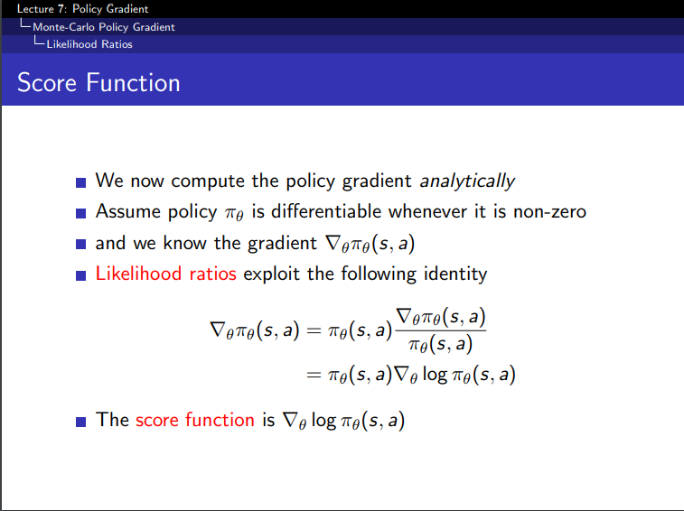
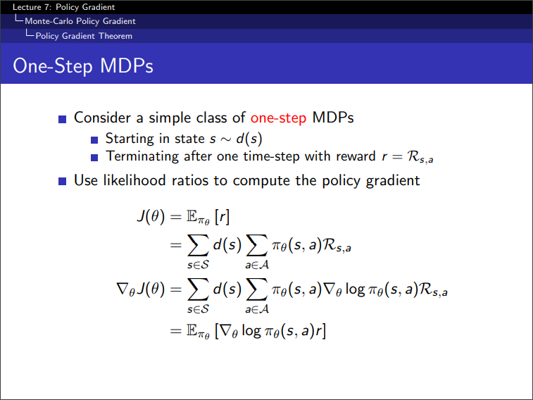

강화학습 라이브러리를 보다보면 torch.distribution.Categorical, torch.distribtuion.Normal 등의 함수가 종종 보인다. 이 함수들의 역할과 왜 사용하는지에 대해 알아보자.

# torch.distribtution


[torch.distribution 공식문서](https://pytorch.org/docs/stable/distributions.html)


결론적으로 말하자면 torch.distribution은 각종 분포에 들어가는 parameter를 computational graph로 이어주기 위한 패키지다. 내부에는 다양한 확률분포들과 샘플링 함수들이 포함되어있다. 강화학습 관점에서 보면 Stochastic 한 policy를 구현하기 위한 패키지로도 볼 수 있다.

기본적으로 random sample은 직접적인 backpropagation을 할 수 없다. 따라서 이를 보완하는 함수들이 있는데 likelihood ratio estimator,REINFORCE 등의 이름으로도 불리는 score function과 pathwise derivative estimator, 크게 두 가지로 나눌 수 있다. pathwise derivative estimator는 vae 등에 많이 쓰인다고 한다. 여기서는 강화학습적 관점으로 score function에 대해서만 알아보겠다.


<p align="center">

 <br>
 <em> David silver lecture 7 slide</em>
</p>


score function는 소위 likelihood ratio trick을 통해 구할 수 있다.likelihood를 나타내는 함수의 gradient를 log likelihood의 gradient와 원래 likelihood의 곱으로 표현하는 방법이다. 이 score function이 one-step reward의 최대화를 목적으로하는 One-step MDP를 만나면 다음 슬라이드와 같이 표현된다.

<p align="center">

</p>

torch.distribution은 distribution parameters에 이와같은 방식의 auto-grad를 붙여주어 sampling을 통해서도 업데이트를 할 수 있도록 해준다. 샘플링을 활용하는 구체적인 예로는 torch.distribution.Normal은 를 neural net 모델의 output을 $\mu$로 하는 강화학습 policy 등을 만들 수 있고, torch.distribution.Categorical은 모델의 output의 softmax값을 $p_i$ 로 하는 multinoulli distribution 등을 구현할 수 있다.참고로 deterministic한 policy만을 구현한다면 굳이 확률분포를 도입하지 않아도 돼 필요성이 떨어진다. 


다음은 OpenAI spinningup의 구현체이다.

```
class MLPGaussianActor(Actor):

    def __init__(self, obs_dim, act_dim, hidden_sizes, activation):
        super().__init__()
        log_std = -0.5 * np.ones(act_dim, dtype=np.float32)
        self.log_std = torch.nn.Parameter(torch.as_tensor(log_std)) # 업데이트를 할 수 있게 nn.Parameter화
        self.mu_net = mlp([obs_dim] + list(hidden_sizes) + [act_dim], activation) # 일반적인 multi-layed perceptron 구조 구현

    def _distribution(self, obs):
        mu = self.mu_net(obs)
        std = torch.exp(self.log_std)
        return Normal(mu, std)

class MLPCategoricalActor(Actor):

    def __init__(self, obs_dim, act_dim, hidden_sizes, activation):
        super().__init__()
        self.logits_net = mlp([obs_dim] + list(hidden_sizes) + [act_dim], activation)
    
    def _distribution(self, obs):
        logits = self.logits_net(obs)
        return Categorical(logits=logits)
```

<p align="center">

</p>