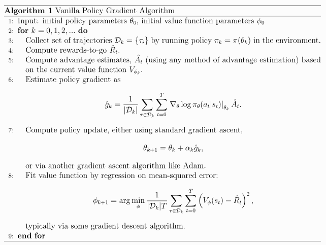

이번 포스팅에서는 강화학습 라이브러리에서 mpi 통신을 어떤식으로 활용할 수 있는지 알아보겠습니다. 
대표적인 예로 OpenAI의 오픈소스 프로젝트인 openai baselines의 방식을 vanila policy gradient 코드와 함께 살펴보겠습니다.

# MPI 코드 실행방법

기본적으로 OpenMPI를 사용한 프로그램을 작동하려면 mpiexec 혹은 mpirun 의 명령어로 코드를 작동시켜야합니다. OpenAI에서는 python을 실행하면서 mpi를 작동시키는 방법으로 
subprocess 모듈을 사용했습니다.

```
def mpi_fork(n, bind_to_core=False):
    """
    Args:
        n (int): Number of process to split into.

        bind_to_core (bool): Bind each MPI process to a core.
    """
    if n<=1: #설정 cpu 갯수가 1이하 일때는 종료
        return
    if os.getenv("IN_MPI") is None:
        env = os.environ.copy()
        env.update(
            MKL_NUM_THREADS="1", # 인텔 mkl thread 수 1 설정
            OMP_NUM_THREADS="1", # OpenMP thread 수 1 설정
            IN_MPI="1" # IN_MPI 라는 환경변수를 Flag로 이용, 중복실행 방지 
        )
        args = ["mpirun", "-np", str(n)] # mpi 명령어와 인수 리스트에 할당
        if bind_to_core:
            args += ["-bind-to", "core"]
        args += [sys.executable] + sys.argv # python 응용프로그램 추가
        subprocess.check_call(args, env=env)
        sys.exit() # subprocess가 끝나면 종료 (fork 뒤의 다음 코드를 실행하지 않게끔)
```
다음처럼 파이썬 내에서 외부 프로세스를 실행하는 방식을 사용하면 디버깅 프로그램을 실행해도 동작하지 않습니다. 따라서 IDE나 python 기본 디버깅 모듈 외에 다른 방법을 강구해야한다는
단점이 있습니다.

# Vanila Policy Gradient with MPI
OpenAI의 Policy Gradient는 흔히 생각하는 REINFORCE 알고리즘이 아닌 GAE(General advantage estimation)를 도입한 TD Actor-Critic 알고리즘입니다. Pseudocode는 다음과 같습니다. 


<p align="center">

</p>

[병렬 프로그래밍(1. 기초)](https://nenomigami.github.io/fundamental/2022-06-30-Parallel/) 포스팅에서 언급한 병렬 프로그래밍 순서는 다음과 같습니다.

1. 병렬화할 부분을 찾아낸다.
2. 병렬화할 부분을 별도 함수로 분리한다.
3. 별도의 쓰레드/프로세스를 생성하여 실행할 함수를 연결한다.
4. 동기화가 필요하면 동기화 기능을 구현한다.

OpenAI 에서는 어떤 부분을 병렬화했는지 살펴봅시다. 다음 vpg코드는 중요하다고 생각되는 일부만 발췌한 내용입니다.

```
def vpg(env_fn, actor_critic=core.MLPActorCritic, ac_kwargs=dict(),  seed=0, 
        steps_per_epoch=4000, epochs=50, gamma=0.99, pi_lr=3e-4,
        vf_lr=1e-3, train_v_iters=80, lam=0.97, max_ep_len=1000,
        logger_kwargs=dict(), save_freq=10):

    # Special function to avoid certain slowdowns from PyTorch + MPI combo.
    setup_pytorch_for_mpi() # 프로세스별로 멀티쓰레드를 분배

    # Set up logger and save configuration
    logger = EpochLogger(**logger_kwargs) # 내부적으로 root node만 기록하게끔 설정되어있음.
    logger.save_config(locals())

    # Instantiate environment
    env = env_fn()
    obs_dim = env.observation_space.shape
    act_dim = env.action_space.shape

    # Create actor-critic module
    ac = actor_critic(env.observation_space, env.action_space, **ac_kwargs)

    # Sync params across processes
    sync_params(ac) # ActorCritic 을 process마다 할당해주고, parameter를 통일한다.
```

```
#mpi_pytorch.py
def sync_params(module):
    if num_procs()==1:
        return
    for p in module.parameters():
        p_numpy = p.data.numpy()
        MPI.COMM_WORLD.Bcast(p_numpy, root = root)
```

parameter를 통일하는 방식은 module의 paramter들을 numpy로 바꾸고 집단통신 broadcast를 이용합니다.
broadcast는 root 프로세스로부터 커뮤니케이터 내의 다른 프로세스로 동일한 데이터를 전송합니다.
sync_params 함수를 통해 ac변수에 root 노드의 ac와 같은 parameter들이 할당되었습니다.


```
#def vpg
# Set up experience buffer
local_steps_per_epoch = int(steps_per_epoch / num_procs()) #분배 한 process 수 만큼 설정한 step을 나누어 갖습니다.
buf = VPGBuffer(obs_dim, act_dim, local_steps_per_epoch, gamma, lam) # buffer size또한 step과 동일하게 설정합니다.

for epoch in range(epochs):
    for t in range(local_steps_per_epoch):
        a, v, logp = ac.step(torch.as_tensor(o, dtype=torch.float32))

        next_o, r, d, _ = env.step(a)
        buf.store(o, a, r, v, logp)

        # Update obs (critical!)
        o = next_o
    update()
```
Pseudocode에서 3-6번째 줄의 병렬화 코드입니다. 각 process별로 step을 진행하여 trajectory를 쌓습니다.
여기서 local_steps_per_epoch는 horizon의 역할을 합니다. 이 값이 클수록 더 긴 길이의 trajectory를 이용하여 
모델을 업데이트할 수 있습니다. 따라서 금방 에피소드가 끝나는 간단한 게임이나, 벽돌깨기처럼 비슷한 dynamics가 반복되는
경우에는 짧게 설정하고, Starcraft 처럼 지금의 행동이 훨씬 멀리까지 영향을 미치는 경우에는 길게 설정할 수 있습니다.
process 수에 따라 local_steps_per_epoch가 달라지기 때문에 Hyperparameter를 설정할 때 고려해줘야합니다.

```
def update(self):
    data = buf.get()
        .
        .
        .
```

이제 대망의 update 함수를 살펴봅시다. 먼저 data를 buffer에서 추출합니다. buffer에서 advantage를 normalize 하기위해 process들을 간의 평균과 분산을 계산합니다.

```
def get(self):
    assert self.ptr == self.max_size    # buffer 는 꽉 차있어야 함.
    self.ptr, self.path_start_idx = 0, 0
    
    adv_mean, adv_std = mpi_statistics_scalar(self.adv_buf) # process들 다같이 통계량 계산
    self.adv_buf = (self.adv_buf - adv_mean) / adv_std #Normalize advantages
    data = dict(obs=self.obs_buf, act=self.act_buf, ret=self.ret_buf,
                adv=self.adv_buf, logp=self.logp_buf)
    return {k: torch.as_tensor(v, dtype=torch.float32) for k,v in data.items()} #텐서화

def mpi_statistics_scalar(x, with_min_and_max = False):
    """
    MPI processes 들 사이에서 다같이 mean, std를 계산한다.
    """
    x = np.array(x, dtype = np.float32)
    global_sum, global_n = mpi_sum([np.sum(x), len(x)])

def mpi_sum(x):
    return mpi_op(x, MPI.SUM)

def mpi_op(x, op):
    x, scalar = ([x], True) if np.isscalar(x) else (x, False)
    x = np.asarray(x, dtype=np.float32) # numpy로 wrapping 해서 통신
    buff = np.zeros_like(x, dtype=np.float32)
    allreduce(x, buff, op=op) # 모든 process에 operation을 하고 공유
    return buff[0] if scalar else buff
```
get 함수는 위와 같습니다. update 함수의 이 다음 step을 보겠습니다. policy gradient와 value gradient를 계산하고 업데이트 합니다. 이또한 mpi 통신을 사용해서 gradient를 평균내어 계산해줍니다.

```
def update():
        .
    # Train policy with a single step of gradient descent
    pi_optimizer.zero_grad()
    loss_pi, pi_info = compute_loss_pi(data)
    loss_pi.backward()
    mpi_avg_grads(ac.pi)    # average grads across MPI processes
    pi_optimizer.step()

    # Value function learning
    for i in range(train_v_iters):
        vf_optimizer.zero_grad()
        loss_v = compute_loss_v(data)
        loss_v.backward()
        mpi_avg_grads(ac.v)    # average grads across MPI processes
        vf_optimizer.step()


def compute_loss_pi(data):
    obs, act, adv, logp_old = data['obs'], data['act'], data['adv'], data['logp']

    pi, logp = ac.pi(obs, act)
    loss_pi = -(logp * adv).mean() # policy_gradient

    return loss_pi, pi_info

def compute_loss_v(data):
    obs, ret = data['obs'], data['ret']
    return ((ac.v(obs) - ret)**2).mean()


def mpi_avg_grads(module):
    """ Average contents of gradient buffers across MPI processes. """
    if num_procs()==1:
        return
    for p in module.parameters():
        p_grad_numpy = p.grad.numpy()   # numpy view of tensor data
        avg_p_grad = mpi_avg(p.grad)
        p_grad_numpy[:] = avg_p_grad[:]
```

이것으로 openai.spinningup 에서 제공하는 a2c의 mpi적용 방법을 알아봤습니다. 
제가 느낀 mpi의 단점으로는 디버깅이 어렵다는 점이 있습니다. mpiexec 혹은 mpirun 명령어가 커맨드에서 실행되기 때문에 IDE에서 debug가 실행되지 않습니다. 그래서 multiprocessing 을 자주 사용하는지도 모르겠습니다.
